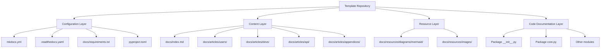
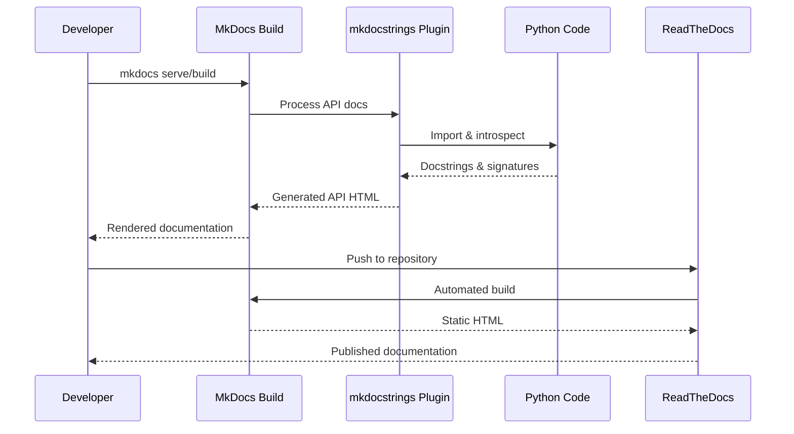
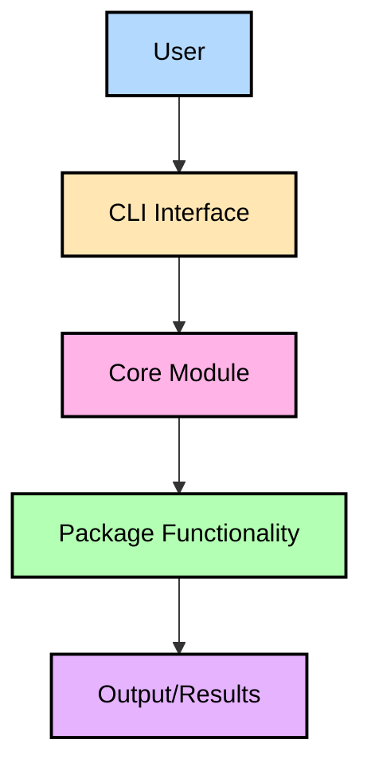
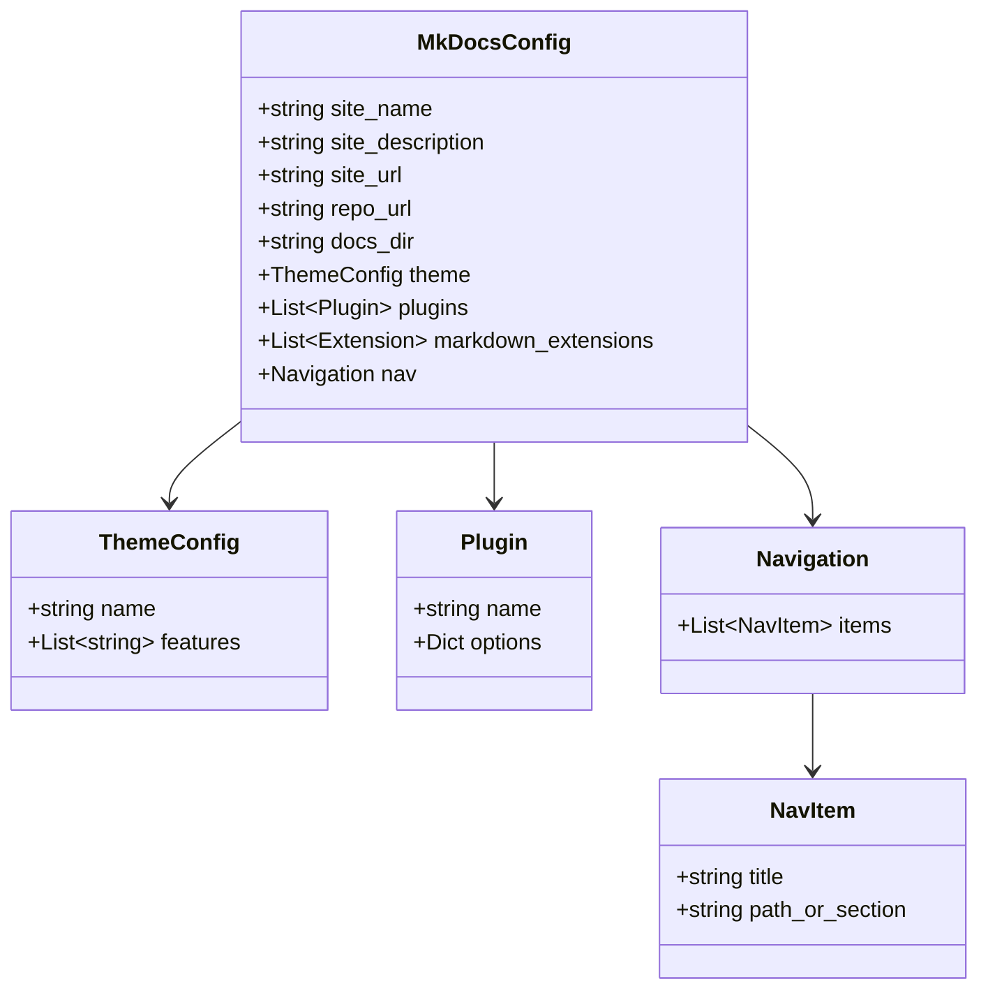
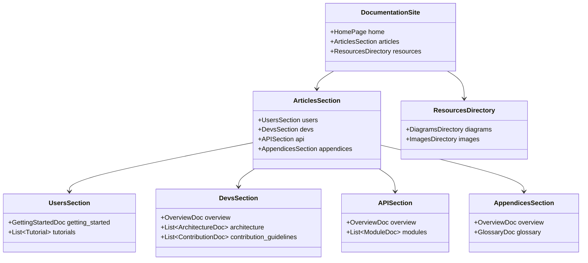

# Design Document: MkDocs Template Setup

## Overview

This design document outlines the implementation of a complete MkDocs documentation infrastructure for the py-repo-template repository. The solution will provide all necessary configuration files, directory structures, and starter content so that any project created from this template has professional, automated documentation generation ready to use without additional setup.

The implementation follows the Cracking Shells organization's documentation standards, including:
- MkDocs with Material theme for modern, responsive documentation
- mkdocstrings for automated API documentation from Google-style docstrings
- ReadTheDocs integration for automated builds and publishing
- Standardized directory structure with clear separation of user, developer, and API content
- Mermaid diagrams as the primary diagramming standard
- Style guide compliance for consistent tone and content quality

## Architecture

### High-Level Structure

The documentation system consists of four main components:

1. **Configuration Layer**: MkDocs configuration, ReadTheDocs configuration, and dependency management
2. **Content Layer**: Markdown documentation files organized by audience and purpose
3. **Resource Layer**: Diagrams, images, and other non-markdown assets
4. **Code Documentation Layer**: Google-style docstrings in Python code for automated API documentation



### Component Interactions



## Components and Interfaces

### 1. Configuration Files

#### mkdocs.yml
**Purpose**: Main MkDocs configuration file defining site structure, theme, plugins, and navigation.

**Location**: Repository root

**Key Sections**:
- Site metadata (name, description, URL)
- Theme configuration (Material theme with features)
- Plugin configuration (search, mkdocstrings)
- Markdown extensions (admonitions, tables, code blocks, TOC)
- Navigation structure (Home, Users, Developers, API Reference, Appendices)

**Template Placeholders**:
- `{{PROJECT_NAME}}` - Project name for site title and URLs
- `{{PROJECT_DESCRIPTION}}` - Project description for site metadata
- `{{PACKAGE_NAME}}` - Python package name for API documentation paths

#### .readthedocs.yaml
**Purpose**: ReadTheDocs build configuration for automated documentation publishing.

**Location**: Repository root

**Configuration**:
- Build OS: Ubuntu 24.04
- Python version: 3.13
- MkDocs configuration reference
- Dependency installation from docs/requirements.txt

#### docs/requirements.txt
**Purpose**: Python dependencies required for building documentation.

**Location**: docs/ directory

**Contents**:
```
mkdocstrings
mkdocstrings-python
mkdocs-material
```

#### pyproject.toml (additions)
**Purpose**: Optional documentation and development dependencies for local development.

**Location**: Repository root

**Additions**:
```toml
[project.optional-dependencies]
docs = [
    "mkdocs>=1.4.0",
    "mkdocstrings[python]>=0.20.0"
]
dev = [
    "ruff>=0.1.0",
    "black>=23.0.0",
    "pre-commit>=3.0.0"
]

[tool.ruff]
line-length = 88
target-version = "py312"
select = [
    "E",   # pycodestyle errors
    "W",   # pycodestyle warnings
    "F",   # pyflakes
    "I",   # isort
    "B",   # flake8-bugbear
    "C4",  # flake8-comprehensions
    "UP",  # pyupgrade
]
ignore = []

[tool.black]
line-length = 88
target-version = ['py312']
include = '\.pyi?$'

[tool.ruff.isort]
known-first-party = ["{{PACKAGE_NAME}}"]
```

#### .pre-commit-config.yaml
**Purpose**: Git hook configuration for automated code quality checks.

**Location**: Repository root

**Configuration**:
```yaml
repos:
  - repo: https://github.com/pre-commit/pre-commit-hooks
    rev: v4.5.0
    hooks:
      - id: trailing-whitespace
      - id: end-of-file-fixer
      - id: check-yaml
      - id: check-added-large-files
      - id: check-toml

  - repo: https://github.com/psf/black
    rev: 23.12.1
    hooks:
      - id: black
        language_version: python3.12

  - repo: https://github.com/astral-sh/ruff-pre-commit
    rev: v0.1.9
    hooks:
      - id: ruff
        args: [--fix, --exit-non-zero-on-fix]
```

#### TEMPLATE_USAGE.md (updates)
**Purpose**: Comprehensive guide for using the template with all new features.

**Location**: Repository root

**Key Updates**:

**Template Variables Section**:
- Add documentation files to replacement list
- Include mkdocs.yml, all docs/**/*.md files

**Variable Replacement Commands**:
```bash
# PowerShell commands for Windows
Get-ChildItem -Recurse -Include *.md,*.yml,*.toml,*.py,*.json | ForEach-Object {
    (Get-Content $_.FullName) -replace '{{PROJECT_NAME}}', 'YourProjectName' | Set-Content $_.FullName
    (Get-Content $_.FullName) -replace '{{PACKAGE_NAME}}', 'your_package_name' | Set-Content $_.FullName
    (Get-Content $_.FullName) -replace '{{PROJECT_DESCRIPTION}}', 'Your project description' | Set-Content $_.FullName
}

# Bash commands for Linux/Mac
find . -type f \( -name "*.md" -o -name "*.yml" -o -name "*.toml" -o -name "*.py" -o -name "*.json" \) -exec sed -i 's/{{PROJECT_NAME}}/YourProjectName/g' {} +
find . -type f \( -name "*.md" -o -name "*.yml" -o -name "*.toml" -o -name "*.py" -o -name "*.json" \) -exec sed -i 's/{{PACKAGE_NAME}}/your_package_name/g' {} +
find . -type f \( -name "*.md" -o -name "*.yml" -o -name "*.toml" -o -name "*.py" -o -name "*.json" \) -exec sed -i 's/{{PROJECT_DESCRIPTION}}/Your project description/g' {} +
```

**Files to Update List**:
- Add mkdocs.yml
- Add .readthedocs.yaml
- Add .pre-commit-config.yaml
- Add docs/index.md
- Add docs/articles/**/*.md (all documentation files)

**Initial Setup Section**:
```bash
# Install all dependencies including docs and dev tools
pip install -e .[docs,dev]

# Set up pre-commit hooks
pre-commit install

# Build documentation locally
mkdocs serve

# Run code quality checks
pre-commit run --all-files
```

**What's Included Section Updates**:

Add new subsections:
- **Documentation Infrastructure**: Complete MkDocs setup with Material theme, mkdocstrings for API docs, ReadTheDocs integration, Mermaid diagram support
- **Code Quality Tools**: ruff for linting, black for formatting, pre-commit hooks for automated checks
- **Development Workflow**: Pre-commit hooks, code quality automation, documentation generation

**What's NOT Included Section Updates**:
- Remove "Code Quality Tools (Deferred)" - now included
- Remove "Comprehensive Documentation (Deferred)" - now included
- Keep "Advanced Testing (Deferred)" - still waiting for wobble

### 2. Documentation Structure

#### Directory Organization

```
docs/
├── index.md                                    # Homepage
├── requirements.txt                            # Build dependencies
├── articles/
│   ├── index.md                               # Articles landing page
│   ├── users/
│   │   ├── GettingStarted.md                 # User getting started guide
│   │   └── tutorials/                         # Tutorial directory (empty initially)
│   ├── devs/
│   │   ├── index.md                          # Developer overview
│   │   ├── architecture/                      # Architecture docs (empty initially)
│   │   ├── contribution_guidelines/           # Contribution guides (empty initially)
│   │   └── implementation_guides/             # Implementation guides (empty initially)
│   ├── api/
│   │   ├── index.md                          # API overview
│   │   └── core.md                           # Core module API docs
│   └── appendices/
│       ├── index.md                          # Appendices TOC
│       └── glossary.md                       # Glossary template
└── resources/
    ├── diagrams/
    │   └── mermaid/
    │       └── example-architecture.mmd       # Example Mermaid diagram
    └── images/                                # Images directory (empty initially)
```

### 3. Development Tooling Configuration

#### Pre-commit Hooks

The template includes pre-commit configuration for automated code quality checks:

**Hooks Included**:
- **trailing-whitespace**: Removes trailing whitespace
- **end-of-file-fixer**: Ensures files end with newline
- **check-yaml**: Validates YAML syntax
- **check-added-large-files**: Prevents large files from being committed
- **check-toml**: Validates TOML syntax
- **black**: Formats Python code consistently
- **ruff**: Lints and auto-fixes Python code

**Setup Process**:
1. Install pre-commit: `pip install pre-commit`
2. Install hooks: `pre-commit install`
3. Hooks run automatically on `git commit`
4. Manual run: `pre-commit run --all-files`

#### Code Quality Tools

**Ruff Configuration**:
- Line length: 88 characters (matches Black)
- Target: Python 3.12
- Enabled rules: pycodestyle, pyflakes, isort, flake8-bugbear, comprehensions, pyupgrade
- Fast execution (10-100x faster than traditional linters)

**Black Configuration**:
- Line length: 88 characters
- Target: Python 3.12
- Opinionated formatting for consistency
- Integrates with ruff for complementary functionality

#### Content Files

**docs/index.md**:
- Welcoming homepage with project overview
- Navigation guidance to main sections
- Quick start information
- Links to key documentation areas

**docs/articles/index.md**:
- Main landing page for articles
- Links to Users, Developers, API Reference, and Appendices sections
- Brief description of each section's purpose

**docs/articles/users/GettingStarted.md**:
- Installation instructions (from source and PyPI)
- Basic usage examples
- Next steps and links to tutorials
- Follows style guide: focused, professional tone with warmth at transitions

**docs/articles/devs/index.md**:
- Development environment setup
- Installing development dependencies (including pre-commit)
- Setting up pre-commit hooks
- Running code quality tools (ruff, black)
- Running tests
- Making commits with conventional commits
- Contributing guidelines overview
- Links to detailed developer documentation

**docs/articles/api/index.md**:
- API reference overview
- Getting started with the API
- Module index with descriptions
- Usage examples demonstrating mkdocstrings

**docs/articles/api/core.md**:
- Automated API documentation for core module
- Uses mkdocstrings syntax: `::: {{PACKAGE_NAME}}.core`

**docs/articles/appendices/index.md**:
- Table of contents for appendices
- Links to glossary and other supplementary content
- Purpose statement for appendices section

**docs/articles/appendices/glossary.md**:
- Template glossary with example terms
- Alphabetical organization with letter sections
- Instructions for adding project-specific terms

### 3. Resource Management

#### Mermaid Diagrams

**Location**: docs/resources/diagrams/mermaid/

**Example Diagram** (example-architecture.mmd):


**Usage in Documentation**:
- Inline embedding in markdown files
- Reference to external .mmd files
- Comments explaining diagram structure

#### Images

**Location**: docs/resources/images/

**Organization**:
- screenshots/ - Application screenshots (empty initially)
- logos/ - Brand assets (empty initially)
- icons/ - UI icons (empty initially)

### 4. Code Documentation

#### Google-Style Docstrings

All Python code in the template will be enhanced with comprehensive Google-style docstrings to demonstrate best practices.

**Module-Level Documentation**:
```python
"""Module for [purpose].

This module provides [detailed description].

Typical usage example:

    ```python
    from {{PACKAGE_NAME}} import module

    result = module.function()
    ```

Classes:
    ClassName: Description of class.

Functions:
    function_name: Description of function.
"""
```

**Function Documentation**:
```python
def function_name(param1: str, param2: int = 0) -> bool:
    """Brief description.

    Longer description explaining purpose and behavior.

    Args:
        param1: Description of first parameter.
        param2: Description of second parameter with default.

    Returns:
        Description of return value.

    Raises:
        ValueError: When this exception is raised.

    Example:
        Basic usage:

        ```python
        result = function_name("hello", 42)
        print(result)  # True
        ```
    """
```

**Class Documentation**:
```python
class ClassName:
    """Brief description.

    Longer description of class purpose and usage.

    Attributes:
        attribute1 (str): Description of attribute.
        attribute2 (int): Description of another attribute.

    Example:
        Basic usage:

        ```python
        instance = ClassName()
        instance.method("data")
        ```
    """
```

## Data Models

### Configuration Data Model



### Documentation Structure Model



## Correctness Properties

*A property is a characteristic or behavior that should hold true across all valid executions of a system-essentially, a formal statement about what the system should do. Properties serve as the bridge between human-readable specifications and machine-verifiable correctness guarantees.*


### Property Reflection

After analyzing all acceptance criteria, most are concrete examples testing that specific files exist with specific content. This is appropriate for a template setup feature. However, four general properties emerged that apply across multiple contexts:

1. **Template placeholder consistency**: All configuration and documentation files should use consistent template placeholders
2. **Docstring completeness**: All public Python code should have complete Google-style docstrings
3. **Cross-file placeholder consistency**: Placeholders should be used consistently across all files
4. **Tool configuration consistency**: Development tool configurations should be compatible and non-conflicting

These properties provide unique validation value beyond the specific file existence checks.

### Correctness Properties

Property 1: Configuration files use template placeholders
*For any* configuration value in mkdocs.yml that references project-specific information (site name, description, URLs, package names), the value should use the appropriate template placeholder ({{PROJECT_NAME}}, {{PROJECT_DESCRIPTION}}, {{PACKAGE_NAME}}) instead of hardcoded values
**Validates: Requirements 1.5, 6.1, 6.2, 6.3, 6.5**

Property 2: Documentation files use template placeholders
*For any* documentation markdown file that references project-specific information, the file should use template placeholders instead of hardcoded project names or package names
**Validates: Requirements 6.4**

Property 3: Public code has complete docstrings
*For any* public function or class in the template package code, the docstring should include all required Google-style sections (brief description, Args if applicable, Returns if applicable, Example)
**Validates: Requirements 9.1**

Property 4: Tool configurations are compatible
*For any* configuration setting in pyproject.toml for development tools (ruff, black), the settings should be compatible and non-conflicting (e.g., line-length should match between ruff and black)
**Validates: Requirements 12.5, 12.6**

## Error Handling

### Configuration Errors

**Invalid mkdocs.yml Syntax**:
- MkDocs will fail to build with clear error messages
- Validation: Test `mkdocs build` command succeeds
- Prevention: Use valid YAML syntax and test locally before committing

**Missing Dependencies**:
- ReadTheDocs build will fail if dependencies are missing from docs/requirements.txt
- Validation: Test that all required packages are listed
- Prevention: Include all mkdocstrings, mkdocs-material, and plugin dependencies

**Invalid Navigation Paths**:
- MkDocs will warn about broken navigation links
- Validation: Ensure all navigation paths point to existing files
- Prevention: Create all referenced files in the template

### Content Errors

**Missing Template Placeholders**:
- Projects created from template will have incorrect project names
- Validation: Check that all project-specific values use placeholders
- Prevention: Use placeholders consistently throughout all files

**Broken Cross-References**:
- Documentation links may be broken if files are missing
- Validation: Test that all internal links point to existing files
- Prevention: Create all referenced files and test links locally

**Invalid Mermaid Syntax**:
- Diagrams may fail to render if syntax is incorrect
- Validation: Test Mermaid diagrams using Mermaid Live Editor or MkDocs build
- Prevention: Validate all Mermaid diagrams before committing

### Build Errors

**ReadTheDocs Build Failures**:
- Documentation won't publish if ReadTheDocs build fails
- Validation: Test that MkDocs builds successfully locally
- Prevention: Ensure all dependencies are correct and all files exist

**mkdocstrings Import Errors**:
- API documentation won't generate if Python modules can't be imported
- Validation: Test that package can be imported and mkdocstrings can process it
- Prevention: Ensure package structure is correct and imports work

## Testing Strategy

### Unit Testing

Unit tests will verify specific examples and configurations:

**Configuration File Tests**:
- Test that mkdocs.yml exists and contains required sections
- Test that .readthedocs.yaml exists and has correct configuration
- Test that docs/requirements.txt exists and contains required packages
- Test that pyproject.toml has docs optional dependencies

**File Structure Tests**:
- Test that all required documentation directories exist
- Test that all required documentation files exist
- Test that resource directories (diagrams, images) exist

**Content Tests**:
- Test that README.md contains documentation link
- Test that navigation structure in mkdocs.yml is correct
- Test that API documentation files use mkdocstrings syntax

**Build Tests**:
- Test that `mkdocs build` command succeeds
- Test that generated HTML contains expected content
- Test that Mermaid diagrams render correctly

### Property-Based Testing

Property-based tests will verify universal properties across the template:

**Property Test 1: Template Placeholder Consistency**
- Library: Hypothesis (Python)
- Test: Parse mkdocs.yml and verify all project-specific values use placeholders
- Validation: No hardcoded project names or package names in configuration
- Iterations: 100 (testing different parsing approaches)

**Property Test 2: Documentation Placeholder Consistency**
- Library: Hypothesis (Python)
- Test: Parse all markdown files and verify project-specific references use placeholders
- Validation: No hardcoded project names in documentation content
- Iterations: 100 (testing all documentation files)

**Property Test 3: Docstring Completeness**
- Library: Hypothesis (Python)
- Test: Inspect all public functions/classes and verify docstrings have required sections
- Validation: All public APIs have complete Google-style docstrings
- Iterations: 100 (testing different code inspection approaches)

### Integration Testing

**End-to-End Documentation Build**:
- Test complete MkDocs build process
- Verify all plugins work correctly
- Verify all navigation links work
- Verify API documentation generates correctly

**ReadTheDocs Simulation**:
- Test build in clean environment matching ReadTheDocs
- Verify dependencies install correctly
- Verify documentation builds without errors

### Manual Testing

**Visual Inspection**:
- Review generated documentation for visual quality
- Verify Material theme renders correctly
- Verify Mermaid diagrams display properly
- Verify code blocks have copy buttons

**Content Quality**:
- Review documentation content for style guide compliance
- Verify tone is professional with appropriate warmth
- Verify cross-references work correctly
- Verify examples are clear and helpful

## Implementation Approach

### Phase 1: Configuration Files

1. Create mkdocs.yml with complete configuration
2. Create .readthedocs.yaml with build settings
3. Create docs/requirements.txt with dependencies
4. Update pyproject.toml with optional docs and dev dependencies
5. Create .pre-commit-config.yaml with code quality hooks
6. Add ruff and black configuration to pyproject.toml

### Phase 2: Directory Structure

1. Create docs/ directory structure
2. Create articles/ subdirectories (users, devs, api, appendices)
3. Create resources/ subdirectories (diagrams/mermaid, images)

### Phase 3: Core Documentation Content

1. Create docs/index.md homepage
2. Create docs/articles/index.md landing page
3. Create docs/articles/users/GettingStarted.md
4. Create docs/articles/devs/index.md
5. Create docs/articles/api/index.md
6. Create docs/articles/api/core.md
7. Create docs/articles/appendices/index.md
8. Create docs/articles/appendices/glossary.md

### Phase 4: Resources

1. Create example Mermaid diagram file
2. Add Mermaid diagram examples to documentation
3. Create placeholder directories for images

### Phase 5: Code Documentation

1. Enhance {{PACKAGE_NAME}}/__init__.py with complete docstrings
2. Enhance {{PACKAGE_NAME}}/core.py with complete docstrings
3. Ensure all functions and classes have Google-style docstrings

### Phase 6: README and Template Usage Updates

1. Update README.md with documentation link
2. Add local documentation build instructions to README
3. Add pre-commit setup instructions to README
4. Add code quality tool usage instructions to README
5. Replace "Coming Soon" placeholder in README
6. Update TEMPLATE_USAGE.md with documentation files in variable replacement list
7. Add grep/sed commands for template variable replacement to TEMPLATE_USAGE.md
8. Update "What's Included" section in TEMPLATE_USAGE.md
9. Update "What's NOT Included" section in TEMPLATE_USAGE.md
10. Add documentation and dev tools setup instructions to TEMPLATE_USAGE.md

### Phase 7: Testing and Validation

1. Test mkdocs build locally
2. Verify all navigation links work
3. Verify API documentation generates correctly
4. Verify Mermaid diagrams render
5. Run property-based tests
6. Validate against all requirements

## Dependencies

### External Dependencies

**MkDocs Ecosystem**:
- mkdocs >= 1.4.0 - Core static site generator
- mkdocs-material - Material Design theme
- mkdocstrings >= 0.20.0 - API documentation plugin
- mkdocstrings-python - Python handler for mkdocstrings

**Development Tools**:
- ruff >= 0.1.0 - Fast Python linter and formatter
- black >= 23.0.0 - Opinionated code formatter
- pre-commit >= 3.0.0 - Git hook management

**Python Environment**:
- Python >= 3.12 - Minimum Python version for template
- Python 3.13 - ReadTheDocs build environment

### Internal Dependencies

**Template Files**:
- pyproject.toml - Project configuration
- README.md - Project documentation
- {{PACKAGE_NAME}}/ - Python package directory

**Existing Patterns**:
- {{PROJECT_NAME}} placeholder pattern
- {{PROJECT_DESCRIPTION}} placeholder pattern
- {{PACKAGE_NAME}} placeholder pattern

## Deployment Considerations

### Template Repository

**Git Considerations**:
- All documentation files should be committed to repository
- Empty directories need .gitkeep files to be tracked
- Binary assets (images) should be optimized before committing

**Template Usage**:
- Users will create new repositories from this template
- All placeholders will need to be replaced in new repositories
- Documentation structure will be copied as-is

### ReadTheDocs Integration

**Project Setup**:
- Each project created from template needs ReadTheDocs project configured
- Webhook integration for automatic builds on push
- Custom domain configuration if needed

**Build Environment**:
- Ubuntu 24.04 ensures consistent builds
- Python 3.13 provides latest language features
- Dependency pinning in docs/requirements.txt ensures reproducibility

### Local Development

**Developer Workflow**:
1. Clone repository
2. Install dependencies: `pip install -e .[docs,dev]`
3. Set up pre-commit: `pre-commit install`
4. Serve documentation: `mkdocs serve`
5. Make changes and test locally
6. Run code quality checks: `pre-commit run --all-files`
7. Build production: `mkdocs build`
8. Commit and push (pre-commit hooks run automatically)

**CI/CD Integration**:
- Consider adding documentation build check to CI pipeline
- Validate that documentation builds without errors
- Check for broken links
- Verify placeholder consistency

## Maintenance and Evolution

### Regular Updates

**Dependency Updates**:
- Monitor MkDocs and plugin releases
- Update docs/requirements.txt when new versions available
- Test compatibility before updating

**Content Updates**:
- Keep documentation aligned with template changes
- Update examples when template structure changes
- Maintain style guide compliance

### Future Enhancements

**Potential Additions**:
- Additional tutorial examples
- More comprehensive API documentation examples
- Additional Mermaid diagram examples
- Internationalization support
- Dark mode theme customization

**Scalability Considerations**:
- Directory structure supports growth
- Navigation structure can accommodate new sections
- Resource organization supports additional assets

## Success Criteria

The implementation will be considered successful when:

1. All configuration files exist and are valid
2. Complete directory structure is in place
3. All required documentation files exist with appropriate content
4. MkDocs builds successfully without errors or warnings
5. All navigation links work correctly
6. API documentation generates from docstrings
7. Mermaid diagrams render correctly
8. All template placeholders are used consistently
9. README.md includes documentation link and build instructions
10. Pre-commit hooks are configured and functional
11. Ruff and black configurations are compatible
12. All property-based tests pass
13. Documentation follows organization style guide
14. Code quality tools run successfully on template code
15. Projects created from template have working documentation and development tools out of the box
