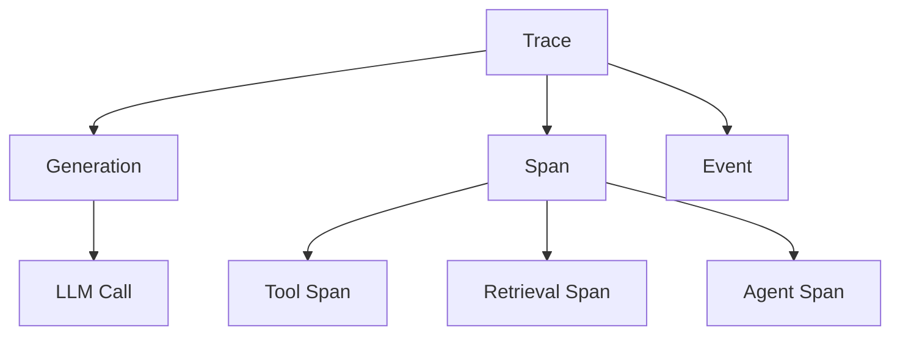

# SPAN Investigation: LiteLLM + Langfuse Integration

**Date**: 2025-12-03  
**Context**: Investigation into why SPANs are not visible in self-hosted Langfuse dashboard when receiving traces from LiteLLM

---

## Executive Summary

**Key Finding**: LiteLLM's default Langfuse integration **does NOT automatically create separate SPAN observations for tool calls**. It only creates **GENERATION observations** for LLM requests. Tool calls appear as metadata within the generation's input/output, not as separate SPANs.

**Root Cause**: SPANs require explicit instrumentation in your application code. They are not automatically extracted from LLM response metadata by LiteLLM.

**Configuration Status**: Your setup is likely correct. The absence of SPANs is expected behavior for basic LiteLLM → Langfuse integration.

---

## Understanding Langfuse Observation Types

### What is a SPAN?

In Langfuse terminology:



**Observation Types**:
- **Generation**: LLM API calls (OpenAI, Anthropic, etc.) - captures model, input, output, tokens
- **Span**: Generic operations (retrieval, processing, tool execution) - captures timing and I/O
- **Event**: Point-in-time actions (logging, checkpoints)
- **Specialized Spans**: Tool, Chain, Retriever, Embedding, Guardrail, Agent

**Reference**: [Langfuse Observation Types](https://langfuse.com/docs/observability/features/observation-types)

### SPAN vs Generation

| Aspect | Generation | Span |
|--------|-----------|------|
| **Purpose** | LLM API calls | Non-LLM operations |
| **Auto-created by** | LLM integrations (OpenAI, LiteLLM) | Manual instrumentation |
| **Contains** | Model, tokens, prompts, completions | Input, output, timing |
| **Tool calls** | Stored as metadata in `tool_calls` field | Requires explicit instrumentation |

---

## LiteLLM → Langfuse: What Gets Logged

### Default Behavior

When you configure LiteLLM with Langfuse:

```python
import litellm
litellm.success_callback = ["langfuse"]
# or
litellm.callbacks = ["langfuse_otel"]
```

**What LiteLLM automatically creates**:
1. **One GENERATION observation per LLM request**
2. **Trace metadata** (trace_id, user_id, session_id, tags)

**What LiteLLM logs in the Generation**:
- Request details: model, messages, parameters (temperature, max_tokens)
- Response details: generated content, token usage, finish reason
- Timing information: request duration, time to first token
- Metadata: user ID, session ID, custom tags
- **Tool calls**: Stored in the generation's `tool_calls` field (NOT as separate SPANs)

**Reference**: [LiteLLM Langfuse Integration - Data Collected](https://github.com/berriai/litellm/blob/main/docs/my-website/docs/observability/langfuse_otel_integration.md)

### Tool Calls in LiteLLM

When an LLM returns tool calls, LiteLLM logs them as part of the generation:

```json
{
  "generation": {
    "model": "gpt-4",
    "input": [...],
    "output": {
      "choices": [{
        "message": {
          "role": "assistant",
          "content": null,
          "tool_calls": [
            {
              "id": "call_abc123",
              "type": "function",
              "function": {
                "name": "get_weather",
                "arguments": "{\"location\": \"Paris\"}"
              }
            }
          ]
        }
      }]
    }
  }
}
```

**The tool call is metadata within the generation, NOT a separate SPAN.**

---

## How to Create SPANs: Instrumentation Required

### Why You Don't See SPANs

SPANs require **explicit instrumentation** in your application code. They represent:
- Tool/function execution (the actual `get_weather()` function call)
- Retrieval operations (database queries, vector searches)
- Processing steps (data transformation, parsing)
- Agent reasoning loops

### Method 1: Using Langfuse SDK with LiteLLM

To create SPANs for tool executions, you need to instrument your code:

```python
from langfuse import observe, get_client
from litellm import completion

langfuse = get_client()

@observe()  # Creates a span for the entire function
def execute_tool(tool_name: str, arguments: dict):
    """Execute a tool and create a SPAN for it"""
    if tool_name == "get_weather":
        return get_weather(**arguments)
    # ... other tools

@observe()
def llm_with_tools(user_message: str):
    # This creates a GENERATION
    response = completion(
        model="gpt-4",
        messages=[{"role": "user", "content": user_message}],
        tools=[...],
        metadata={
            "existing_trace_id": langfuse.get_current_trace_id(),
            "parent_observation_id": langfuse.get_current_observation_id(),
        }
    )
    
    # Check for tool calls
    if response.choices[0].message.tool_calls:
        for tool_call in response.choices[0].message.tool_calls:
            # This creates a SPAN for tool execution
            result = execute_tool(
                tool_call.function.name,
                json.loads(tool_call.function.arguments)
            )
    
    return response
```

**Reference**: [Langfuse Python Instrumentation](https://langfuse.com/docs/observability/sdk/python/instrumentation)

### Method 2: Manual SPAN Creation

For more control, create SPANs explicitly:

```python
from langfuse import get_client

langfuse = get_client()

with langfuse.start_as_current_span(
    name="tool-execution",
    input={"tool": "get_weather", "args": {"location": "Paris"}},
) as span:
    # Execute the tool
    result = get_weather("Paris")
    
    # Update the span
    span.update(output={"result": result})
```

### Method 3: Using Framework Integrations

Some frameworks automatically create SPANs:

**LangChain**:
```python
from langchain.agents import AgentExecutor
from langfuse.callback import CallbackHandler

# LangChain automatically creates SPANs for tool calls
handler = CallbackHandler()
agent_executor = AgentExecutor(agent=agent, tools=tools, callbacks=[handler])
```

**OpenAI Agents SDK**:
```python
from agents import Agent, function_tool

@function_tool  # Automatically creates SPAN when called
def get_weather(city: str) -> str:
    return f"Weather in {city}"
```

**Reference**: [Langfuse Integrations](https://langfuse.com/docs/integrations)

---

## Configuration Verification

### Check Your LiteLLM Setup

**For LiteLLM SDK**:
```python
import litellm
import os

# Verify these are set
print(os.environ.get("LANGFUSE_PUBLIC_KEY"))
print(os.environ.get("LANGFUSE_SECRET_KEY"))
print(os.environ.get("LANGFUSE_HOST"))

# Verify callback is configured
print(litellm.success_callback)  # Should include "langfuse"
# or
print(litellm.callbacks)  # Should include "langfuse_otel"
```

**For LiteLLM Proxy** (`config.yaml`):
```yaml
litellm_settings:
  success_callback: ["langfuse"]
  # or
  callbacks: ["langfuse_otel"]
```

**Environment variables**:
```bash
export LANGFUSE_PUBLIC_KEY="pk-lf-..."
export LANGFUSE_SECRET_KEY="sk-lf-..."
export LANGFUSE_HOST="https://your-langfuse-instance.com"
```

### Enable Debug Logging

To verify data is being sent:

**SDK**:
```python
import litellm
litellm._turn_on_debug()
```

**Proxy**:
```bash
export LITELLM_LOG="DEBUG"
litellm --config config.yaml
```

This will show:
- Endpoint resolution
- Authentication header creation
- OTEL trace submission
- Any errors in the integration

---

## What You Should See in Langfuse

### With Default LiteLLM Integration

**Trace Structure**:
```
Trace: "chat-completion-xyz"
└── Generation: "gpt-4-completion"
    ├── Input: messages, model, parameters
    ├── Output: response content, tool_calls (if any)
    ├── Usage: prompt_tokens, completion_tokens
    └── Metadata: trace_id, user_id, session_id, tags
```

**In the Langfuse UI**:
- You'll see the trace
- You'll see the generation (LLM call)
- Tool calls appear in the generation's output metadata
- **No separate SPAN observations** (unless you instrument them)

### With Instrumented Tool Calls

**Trace Structure**:
```
Trace: "agent-workflow-xyz"
├── Span: "agent-loop"
│   ├── Generation: "gpt-4-completion"
│   │   └── Output: tool_calls: [get_weather]
│   └── Span: "tool-execution-get_weather"  ← This is what you want
│       ├── Input: {location: "Paris"}
│       └── Output: {result: "20°C, sunny"}
└── Generation: "gpt-4-final-response"
```

---

## Recommendations

### 1. Verify Your Setup is Working

**Test that traces are being received**:
1. Make a simple LLM call through LiteLLM
2. Check Langfuse dashboard for the trace
3. Verify you see a GENERATION observation
4. Check if tool_calls appear in the generation's output

If you see generations but no tool_calls metadata, your LLM might not be using tools.

### 2. Understand Expected Behavior

**This is normal**:
- Seeing only GENERATION observations from LiteLLM
- Tool calls appearing as metadata within generations
- No separate SPAN observations without instrumentation

**This indicates a problem**:
- No traces appearing in Langfuse at all
- Traces appearing but no generations
- Authentication errors in LiteLLM logs

### 3. Add Instrumentation for SPANs

If you want to see tool executions as separate SPANs:

**Option A**: Use Langfuse SDK alongside LiteLLM
```python
from langfuse import observe

@observe()  # Automatically creates SPANs
def your_tool_function():
    pass
```

**Option B**: Switch to a framework with built-in instrumentation
- LangChain + Langfuse callback
- OpenAI Agents SDK + Langfuse
- CrewAI + Langfuse

**Option C**: Manually instrument critical operations
```python
with langfuse.start_as_current_span(name="operation"):
    # your code
    pass
```

### 4. Configuration Flags to Check

**LiteLLM flags that might affect logging**:

```python
# Don't set this if you want to see tool calls
litellm.turn_off_message_logging = False  # Default

# Check if you're masking output
metadata = {
    "mask_input": False,  # Default
    "mask_output": False,  # Default
}
```

**Langfuse flags**:
```yaml
# In LiteLLM config.yaml
litellm_settings:
  langfuse_default_tags: ["cache_hit", "proxy_base_url", ...]
  redact_user_api_key_info: false  # Default
```

---

## Common Misconceptions

### ❌ "LiteLLM should automatically create SPANs for tool calls"

**Reality**: LiteLLM creates GENERATION observations. Tool calls are logged as metadata within the generation. Separate SPAN observations require explicit instrumentation.

### ❌ "I'm missing a configuration flag"

**Reality**: If you see generations in Langfuse, your configuration is correct. SPANs require code changes, not configuration changes.

### ❌ "Self-hosted Langfuse doesn't support SPANs"

**Reality**: Self-hosted Langfuse has full SPAN support. The issue is that SPANs aren't being created by your application.

---

## Next Steps

### Immediate Actions

1. **Verify basic integration works**:
   - Make a simple LLM call
   - Check Langfuse for the trace
   - Confirm you see a GENERATION

2. **Check if tool calls are in generation metadata**:
   - Make an LLM call that uses tools
   - In Langfuse, inspect the generation's output
   - Look for `tool_calls` field

3. **Enable debug logging**:
   ```python
   litellm._turn_on_debug()
   ```
   - Check for any errors
   - Verify data is being sent to Langfuse

### To Get SPANs

1. **Choose an instrumentation approach**:
   - Langfuse SDK decorators (`@observe()`)
   - Manual span creation
   - Framework integration (LangChain, etc.)

2. **Instrument your tool execution code**:
   - Wrap tool functions with `@observe()`
   - Or use `langfuse.start_as_current_span()`

3. **Link instrumentation to LiteLLM traces**:
   ```python
   metadata={
       "existing_trace_id": langfuse.get_current_trace_id(),
       "parent_observation_id": langfuse.get_current_observation_id(),
   }
   ```

---

## References

### Documentation

- [Langfuse Observation Types](https://langfuse.com/docs/observability/features/observation-types)
- [LiteLLM Langfuse Integration](https://docs.litellm.ai/docs/observability/langfuse_integration)
- [Langfuse Python SDK Instrumentation](https://langfuse.com/docs/observability/sdk/python/instrumentation)
- [LiteLLM OTEL Integration](https://docs.litellm.ai/docs/observability/langfuse_otel_integration)

### Key Insights from Documentation

1. **LiteLLM creates GENERATION observations** for LLM calls
2. **Tool calls are metadata** within generations, not separate observations
3. **SPANs require explicit instrumentation** via Langfuse SDK or framework integrations
4. **Framework integrations** (LangChain, OpenAI Agents) automatically create SPANs for tool calls
5. **Self-hosted Langfuse** has identical SPAN support to cloud version

---

## Conclusion

Your Langfuse + LiteLLM setup is likely configured correctly. The absence of SPANs is **expected behavior** for basic LiteLLM integration. LiteLLM logs tool calls as metadata within GENERATION observations, not as separate SPANs.

To see tool executions as separate SPAN observations, you need to add instrumentation to your application code using the Langfuse SDK or a framework integration that provides automatic instrumentation.

**No configuration flag will change this behavior** - it requires code-level instrumentation.
