# Developer Documentation

This article covers:
- Setting up your development environment
- Running code quality tools
- Running tests
- Making commits with conventional commits
- Contributing to the project

## Development Environment Setup

### Clone the Repository

```bash
git clone https://github.com/crackingshells/{{PROJECT_NAME}}.git
cd {{PROJECT_NAME}}
```

### Install Dependencies

Install the package with documentation and development dependencies:

```bash
pip install -e .[docs,dev]
```

This installs:
- The package in editable mode
- Documentation tools (MkDocs, mkdocstrings)
- Development tools (ruff, black, pre-commit)

### Set Up Pre-commit Hooks

Configure pre-commit hooks to run code quality checks automatically:

```bash
pre-commit install
```

Pre-commit hooks run automatically on every commit and check for:
- Trailing whitespace
- File endings
- YAML and TOML syntax
- Code formatting (black)
- Linting issues (ruff)

## Code Quality Tools

### Running All Checks

Run all pre-commit hooks manually:

```bash
pre-commit run --all-files
```

### Formatting with Black

Black formats Python code automatically:

```bash
black .
```

### Linting with Ruff

Ruff checks for code quality issues:

```bash
ruff check .
```

Fix issues automatically:

```bash
ruff check --fix .
```

## Running Tests

Execute the test suite:

```bash
pytest
```

Run tests with coverage:

```bash
pytest --cov={{PACKAGE_NAME}}
```

## Making Commits

This project uses [Conventional Commits](https://www.conventionalcommits.org/) for commit messages. Format your commits as:

```
<type>(<scope>): <description>

[optional body]

[optional footer]
```

Common types:
- `feat`: New feature
- `fix`: Bug fix
- `docs`: Documentation changes
- `style`: Code style changes (formatting, etc.)
- `refactor`: Code refactoring
- `test`: Adding or updating tests
- `chore`: Maintenance tasks

Example:

```bash
git commit -m "feat(core): add new greeting function"
```

## Building Documentation

### Local Development

Serve documentation locally with live reload:

```bash
mkdocs serve
```

Open http://127.0.0.1:8000 in your browser.

### Production Build

Build static documentation:

```bash
mkdocs build
```

Generated files appear in the `site/` directory.

## Contributing Guidelines

### Before Submitting

1. Run all code quality checks: `pre-commit run --all-files`
2. Run the test suite: `pytest`
3. Build documentation: `mkdocs build`
4. Use conventional commit format

### Pull Request Process

1. Fork the repository
2. Create a feature branch
3. Make your changes
4. Run all checks and tests
5. Commit using conventional commits
6. Push to your fork
7. Open a pull request

## Development Workflow

The following diagram illustrates the typical development workflow for contributing to {{PROJECT_NAME}}:

```mermaid
%% Development Workflow Diagram
%% This shows the sequence of steps a developer follows
%% when contributing to the project
graph LR
    %% Define workflow steps
    A[Clone Repository] --> B[Install Dependencies]
    B --> C[Create Feature Branch]
    C --> D[Make Changes]
    D --> E[Run Tests]
    E --> F{Tests Pass?}
    F -->|No| D
    F -->|Yes| G[Run Code Quality]
    G --> H{Quality Checks Pass?}
    H -->|No| D
    H -->|Yes| I[Commit Changes]
    I --> J[Push & Create PR]

    %% High contrast styling with black text and borders
    style A fill:#b3d9ff,stroke:#000,stroke-width:2px,color:#000
    style B fill:#ffe6b3,stroke:#000,stroke-width:2px,color:#000
    style C fill:#ffb3e6,stroke:#000,stroke-width:2px,color:#000
    style D fill:#b3ffb3,stroke:#000,stroke-width:2px,color:#000
    style E fill:#e6b3ff,stroke:#000,stroke-width:2px,color:#000
    style F fill:#ffcccc,stroke:#000,stroke-width:2px,color:#000
    style G fill:#ccffcc,stroke:#000,stroke-width:2px,color:#000
    style H fill:#ffcccc,stroke:#000,stroke-width:2px,color:#000
    style I fill:#ccccff,stroke:#000,stroke-width:2px,color:#000
    style J fill:#ffffcc,stroke:#000,stroke-width:2px,color:#000
```



## Additional Resources

As the project grows, additional developer documentation will be added here:
- Architecture documentation - System design and architecture decisions
- Detailed contribution guidelines - Extended contribution process
- Implementation guides - Technical implementation details
